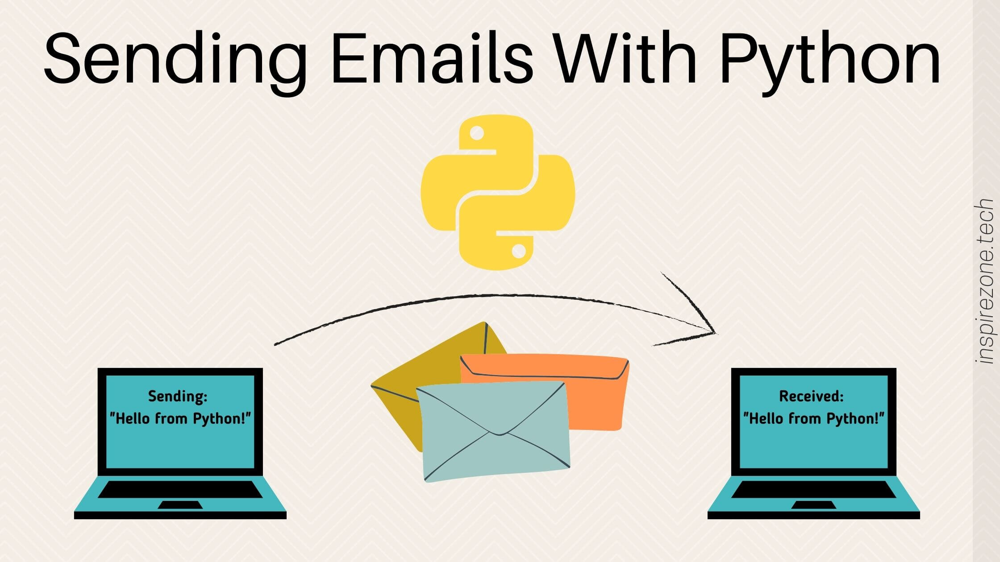

<div align="center">
  
</div>
<br>

# PyAutoMail

[](https://pyautomail.readthedocs.io/en/latest/?badge=latest)


[](https://opensource.org/licenses/MIT)


Scripts Python para enviar e-mail usando a API do Gmail, o que ajuda você a economizar tempo e custo em sua campanha de e-mail e tem uma chance maior de enviar e-mail para a caixa de entrada.

Este projeto é uma solução automatizada para enviar e-mails em massa a partir de uma lista de destinatários. Ele permite que os usuários enviem e-mails personalizados para uma lista de clientes, lendo os endereços de e-mail de um arquivo Excel e o conteúdo do e-mail de um arquivo de texto.

## Funcionalidades

- Envio automatizado de e-mails todos os dias às 10 horas da manhã.
- Leitura dos destinatários de um arquivo Excel (`clients.xlsx`).
- Uso de um arquivo de texto para o conteúdo do e-mail (`message.txt`).
- Registro de logs para acompanhar os envios de e-mails.
- Estrutura de projeto profissional com testes unitários.

## Prerequisites

```bash
Python 3.9 ou superiror
```

```bash
pip 9.0.3
```

> **Atention** Antes de começar, certifique-se de que você tenha o Python instalado em sua máquina. Além disso, é necessário um arquivo `.env` com as credenciais de e-mail do remetente.


## Instalação

```bash
pip install mailipy
```

Para enviar e-mails, você precisa primeiro **gerá-los** e depois **enviar**
eles.

### Instalando [Etapas para executar o script]

```bash
pip install httplib2
pip install oauth2client
pip install apiclient
pip install --upgrade google-api-python-client
pip install --upgrade python-gflags
```

## Configuração

1. Clone o repositório para a sua máquina local.
- **NOTE**: Não será necessário pois esse projeto não está sendo utilizado o Github, mas caso estivesse era só clonar o *repo*
2. Instale as dependências utilizando `pip install -r requirements.txt`.
3. Configure o arquivo `config\.env` com as seguintes variáveis:

```bash
SMTP_SERVER=smtp.gmail.com
EMAIL_PORT=587
SENDER_EMAIL=e-mail
SENDER_EMAIL_PASS=senhaApp
EMAIL_SEND_TIME=14:47
```

## Uso

Para usar o aplicativo, siga os passos abaixo:

1. Prepare o arquivo `clients.xlsx` com os detalhes dos destinatários.
2. Escreva o conteúdo do e-mail no arquivo `message.txt`.
3. Execute o script principal com `python app/main.py`.

## Executando o projeto na versão sem o uso da Interface Gráfica

<video width="900" height="500" controls>
  <source src="dist/public/code.mp4" type="video/mp4">
  Seu navegador não suporta a tag de vídeo.
</video>

## Executando testes

Depois de instalar com 'pipenv install' e entrar no 'pipenv shell', execute o
seguinte:

```Bash
Pytest
```

O comando procurará recursivamente por arquivos chamados '*_test.py' e os executará.
Consulte a [documentação do pytest](https://docs.pytest.org/en/latest/contents.html).


```bash
ProjetoEmailEmMassa/
│
├── app/                            # Diretório principal da aplicação
│   ├── __init__.py                 # Inicializa o pacote Python
│   ├── main.py                     # Script principal do aplicativo
│   ├── email_sender.py             # Módulo para funções de envio de e-mail
│   ├── config.py                   # Configurações do aplicativo
│   └── utils/                      # Módulos utilitários
│       ├── __init__.py
│       └── helper_functions.py     # Funções auxiliares
│
├── tests/                          # Testes unitários e de integração
│   ├── __init__.py
│   ├── test_email_sender.py
│   └── test_helper_functions.py
│
├── data/                           # Dados necessários para o aplicativo, como listas de e-mails
│   ├── clients.xlsx
│   └── message.txt
│
├── docs/                           # Documentação do projeto
│   ├── installation.md
│   ├── usage_guide.md
│   └── CHANGELOG.md
│
├── logs/                           # Logs do aplicativo
│   └── email_sending.log
│
├── scripts/                        # Scripts úteis, como scripts de inicialização
│   └── run.sh
│
├── venv/                           # Ambiente virtual Python
│
├── .gitignore                      # Arquivo para ignorar arquivos no Git
├── setup.py                        # Script de setup para instalação do pacote
├── requirements.txt                # Dependências do projeto
├── README.md                       # Descrição do projeto, instruções de instalação e uso
└── LICENSE                         # Licença do software
```

### Explicação da Estrutura: 
- **app/** : Contém o código-fonte principal da aplicação, dividido em módulos para facilitar a manutenção e a compreensão. 
- **tests/** : Inclui testes automatizados, fundamentais para garantir a confiabilidade do código. 
- **data/** : Armazena arquivos de dados, como listas de clientes e templates de mensagens de e-mail. 
- **docs/** : Contém a documentação do projeto, incluindo um guia de uso, instruções de instalação e o registro de mudanças (`CHANGELOG.md`). 
- **logs/** : Diretório para armazenar logs gerados pela aplicação. 
- **scripts/** : Scripts úteis para o projeto, como scripts de inicialização ou de automação. 
- **venv/** : Ambiente virtual para isolamento das dependências do projeto. 
- **.gitignore** : Lista de arquivos e diretórios que devem ser ignorados pelo controle de versão. 
- **setup.py** : Script para facilitar a instalação do projeto como um pacote. 
- **requirements.txt** : Lista todas as dependências externas do projeto. 
- **README.md** : Fornece uma visão geral e informações essenciais sobre o projeto. 
- **LICENSE** : Define a licença sob a qual o projeto é disponibilizado.

- `app/`: Contém o código-fonte principal. 
- `tests/`: Contém testes unitários. 
- `data/`: Armazena arquivos de dados como `clients.xlsx` e `message.txt`. 
- `logs/`: Diretório para arquivos de log. 
- `venv/`: Ambiente virtual Python. 
- `.gitignore`: Arquivo para ignorar arquivos no Git. 
- `setup.py`: Script de setup para instalação do pacote. 
- `requirements.txt`: Dependências do projeto. 
- `README.md`: Este arquivo. 
- `LICENSE`: Licença do software.

## ⚠️ Pré-requisito
- *Antes de usar este programa, por favor, passe pela seção Pré-requisitos*

### Habilitando a verificação em 2 etapas
- Vá para a sua [Conta do Google](https://myaccount.google.com/) da qual você gostaria de enviar e-mail-bombas.
- Selecione [Segurança](https://myaccount.google.com/security).
- Ativar [Verificação em 2 etapas](https://myaccount.google.com/signinoptions/two-step-verification).


## ⚙️ Criar senha do aplicativo
- Vá para [App Passwords](https://myaccount.google.com/apppasswords).
- Selecione o aplicativo como Mail.
- Selecione o dispositivo como seu dispositivo, por exemplo, Windows Computer etc.
  - Caso não tenha esta opção disponível:
    - Você ativou a Proteção Avançada.
    - A Verificação em 2 Etapas não está configurada para a sua conta.
    - A verificação em 2 etapas só é configurada para chaves de segurança.
    - Sua conta está sob o controle do trabalho, da escola ou de uma organização.
    


## 🖧 Use a senha do aplicativo

- Copie e salve a senha do aplicativo, pois esta seria sua senha para envio de e-mails.
- Use a senha do aplicativo no script Email-Bomber.
- **MUITO IMPORTANTE**: Inclua espaços ao digitar a senha do aplicativo
  - considerando a senha do aplicativo acima como um exemplo
  - senha digitada corretamente -> **alig makn stv lain**
  - senha digitada incorretamente -> **aligmaknstvlain**

## Executando Testes

Para executar os testes, use o comando:

```bash
python -m unittest discover
```

## Código

- O arquivo app.py consta esse código

<p align="left">
   
</p>

## Automatizando a Execução

Utilize o script `run.sh` para automatizar a execução do projeto:

```bash
./run.sh
```

## Rodar o projeto

### Instruções:

1. **)** : Especifica que o script deve ser executado usando o Bash, que é o shell padrão na maioria dos sistemas Unix/Linux. 
2. **Navegação para o Diretório do Projeto** : Altere `/caminho/para/seu/projeto` para o caminho absoluto onde seu projeto está localizado.
3. **Ativar Ambiente Virtual** : Se você estiver usando um ambiente virtual (recomendado), este comando ativa o ambiente. O caminho `venv/bin/activate` deve ser ajustado se o seu ambiente virtual estiver em um local diferente ou se tiver um nome diferente. 
1. **Executar Testes** : Esta linha é opcional e serve para executar qualquer teste unitário que você tenha criado para o projeto. Pode ser removido se você preferir executar testes separadamente. 
2. **Executar o Script Principal** : Altere `app/main.py` para o caminho do seu script Python principal. Este é o comando que inicia o processo de envio de e-mails. 
3. **Desativar o Ambiente Virtual** : Se você ativou um ambiente virtual, é uma boa prática desativá-lo após a conclusão do script. 
4. **Mensagens de Echo** : São usadas para imprimir mensagens no terminal, indicando o que o script está fazendo.

### Como Executar o Script `run.sh`: 

1. Salve este script em um arquivo chamado `run.sh` na raiz do seu projeto.
2. Abra o terminal e navegue até a raiz do seu projeto. 
3. Torne o script executável com o comando: `chmod +x run.sh`. 
4. Execute o script com: `./run.sh`.

### Código

```sh
#!/bin/bash

# Navegar para o diretório do projeto
cd /caminho/para/seu/projeto

# Ativar o ambiente virtual, se aplicável
source venv/bin/activate

# Executar testes (opcional)
echo "Executando testes..."
python -m unittest discover

# Executar o script principal do projeto
echo "Iniciando o script de envio de e-mails..."
python app/main.py

# Desativar o ambiente virtual
deactivate

echo "Script de envio de e-mails finalizado."
```

## Makefile

### Explicação do `Makefile`:

- **install**: Instala as dependências do projeto listadas no arquivo `requirements.txt`.
- **test**: Executa os testes unitários encontrados no projeto usando o módulo `unittest` do Python.
- **run**: Executa o script principal do projeto. Você precisa ajustar `app/main.py` para o caminho do seu script principal.
- **clean**: Remove arquivos Python compilados (`.pyc`) e diretórios `__pycache__`, que são gerados automaticamente durante a execução do projeto.
- **help**: Exibe informações sobre os comandos disponíveis no `Makefile`.
- `.PHONY`: Declaração que especifica que os nomes `install`, `test`, `run`, `clean` e `help` não representam arquivos.

### Como Usar o `Makefile`:

Para usar este `Makefile`, basta digitar comandos `make` seguidos pelo nome da tarefa no terminal. Por exemplo:

- Para instalar dependências: `make install`
- Para executar testes: `make test`
- Para executar o aplicativo: `make run`
- Para limpar arquivos compilados: `make clean`
- Para ver a ajuda: `make help`

Certifique-se de que você está no diretório onde o `Makefile` está localizado ao executar esses comandos.

### Código

```makefile
# Definições
PYTHON = python3
PIP = pip3

# Instalar dependências
install:
	@echo "Instalando dependências..."
	$(PIP) install -r requirements.txt

# Executar testes
test:
	@echo "Executando testes..."
	$(PYTHON) -m unittest discover

# Executar o script principal
run:
	@echo "Executando aplicação..."
	$(PYTHON) app/main.py

# Limpar arquivos Python compilados
clean:
	@echo "Limpando arquivos..."
	find . -type f -name '*.pyc' -delete
	find . -type d -name '__pycache__' -exec rm -r {} +

# Ajuda
help:
@echo "Comandos disponíveis:"
@echo " make install - Instala as dependências do projeto"
@echo " make test - Executa os testes unitários"
@echo " make run - Executa o script principal"
@echo " make clean - Limpa arquivos Python compilados"

.PHONY: install test run clean help
```

## Arquivo `setup.py`

### Introdução

O `setup.py` é um arquivo de configuração em Python, usado principalmente para gerenciar a distribuição de pacotes Python. Ele interage com a biblioteca `setuptools`, facilitando a compilação, distribuição e instalação de pacotes Python.

- Para executar o arquivo `setup.py` em um projeto Python, você geralmente usa o comando `python` seguido pelo caminho do arquivo `setup.py` e a ação que deseja realizar. O arquivo `setup.py` é comumente usado para distribuir e instalar pacotes Python. Ele interage com o `setuptools`, uma biblioteca que facilita a construção e distribuição de pacotes Python.

### Objetivos do `setup.py` 

1. **Gerenciar Dependências** : Define as bibliotecas necessárias para o funcionamento do pacote. 
2. **Facilitar a Instalação** : Permite que usuários instalem facilmente o pacote e suas dependências. 
3. **Suportar Distribuição** : Prepara o pacote para distribuição (e.g., PyPI). 
4. **Configurar Metadados** : Define informações sobre o pacote, como nome, versão, autor, etc. 
5. **Personalizar a Instalação** : Permite customizar a instalação, por exemplo, compilando módulos de C.

### Uso Básico 
- **Instalar um Pacote** : `python setup.py install` 
- **Desenvolvimento de Pacotes** : `python setup.py develop` ou `pip install -e .` 
- **Criar Distribuições** : `python setup.py sdist bdist_wheel`

### Estrutura Básica do `setup.py`

```python
from setuptools import setup, find_packages

setup(
    name='nome_do_pacote',
    version='0.1.0',
    author='Nome do Autor',
    description='Descrição do Pacote',
    packages=find_packages(),
    install_requires=[
        # Lista de dependências
    ],
)
```

### Boas Práticas 
1. **Versionamento Semântico** : Use [SemVer](https://semver.org/)  para versionar seu pacote. 
2. **Documentação Clara** : Inclua comentários e documentação sobre como o pacote deve ser usado e instalado. 
3. **requirements** : Mantenha um `requirements.txt` para gerenciar dependências de desenvolvimento.

#### 1. Instalando o Pacote

Se o `setup.py` foi criado para permitir a instalação do seu pacote ou aplicativo Python, você pode instalá-lo usando:

```bash
python setup.py install
```

Esse comando instalará o pacote no seu ambiente Python atual. É recomendável fazer isso dentro de um ambiente virtual para evitar alterar as bibliotecas no ambiente global do Python.

#### 2. Desenvolvendo o Pacote

Para instalar o pacote de forma que as alterações no código sejam refletidas imediatamente (sem precisar reinstalar após cada alteração), use:

```bash
python setup.py develop
```

Ou, se estiver usando `pip`, você pode usar:

```bash
pip install -e .
```

Este comando cria um link para o código-fonte no seu ambiente Python, permitindo que você teste as alterações sem a necessidade de reinstalar o pacote.

#### 3. Criando Distribuições

Se você deseja criar uma distribuição do seu pacote (por exemplo, um arquivo `.whl` ou `.tar.gz`), você pode usar:

```bash
python setup.py sdist bdist_wheel
```

Isso criará uma distribuição que pode ser enviada para o Python Package Index (PyPI) ou instalada diretamente com `pip`.

### Notas Adicionais:

- Antes de executar `setup.py`, certifique-se de que você está no diretório correto onde o `setup.py` está localizado.
- É uma boa prática usar um ambiente virtual para isolar as dependências do seu projeto das globais. 
- Se o seu projeto tem dependências listadas em `requirements.txt`, certifique-se de instalá-las usando `pip install -r requirements.txt` antes de executar `setup.py`.

### Considerações Finais

- O `setup.py` é essencial para a distribuição de pacotes Python, especialmente para compartilhamento público.
- Deve ser usado com práticas de versionamento e documentação adequadas para garantir a melhor experiência para outros desenvolvedores e usuários.---

Lembre-se de que o `setup.py` é mais comumente usado para pacotes que serão distribuídos e compartilhados com outros, não para scripts de automação ou aplicações que serão executadas internamente. Se o seu projeto é uma ferramenta interna ou um script, talvez não seja necessário um `setup.py`.

- O arquivo `setup.py` é um componente crucial em muitos projetos Python, especialmente aqueles destinados a serem distribuídos e compartilhados com outros. Vou criar um roadmap no formato de um arquivo Markdown (`.md`) para explicar a finalidade e o uso do `setup.py`

## Install

### Instruções para usar o `install.sh`:

1. Coloque este script na raiz do seu projeto. 
2. Torne-o executável com o comando `chmod +x install.sh`. 
3. Execute o script com `./install.sh`.

### Notas: 
- Este script assume que você tem um arquivo `requirements.txt` no seu projeto com todas as dependências necessárias.
- Se o seu projeto tiver etapas adicionais de configuração, você deve adicionar esses comandos ao final do script. 
- A parte de ativação do ambiente virtual (`source venv/bin/activate`) é específica para ambientes Unix. Se você planeja usar este script em ambientes Windows, a linha correspondente deverá ser ajustada.
- Este

script não inclui a clonagem do repositório Git, presumindo que você já tenha o código-fonte do projeto em sua máquina local. Se necessário, você pode adicionar um passo para clonar o repositório antes de iniciar a instalação.

### Código

```sh
#!/bin/bash

# Parar a execução se ocorrer algum erro
set -e

# Mensagem de boas-vindas
echo "Iniciando a instalação do projeto..."

# Verifica se o Python está instalado
if ! command -v python3 &> /dev/null
then
    echo "Python 3 não encontrado. Por favor, instale o Python 3."
    exit 1
fi

# Opcional: Verifica se o git está instalado (se o seu projeto precisa de git)
if ! command -v git &> /dev/null
then
    echo "Git não encontrado. Por favor, instale o Git."
    exit 1
fi

# Criar um ambiente virtual Python
echo "Criando um ambiente virtual..."
python3 -m venv venv

# Ativar o ambiente virtual
echo "Ativando o ambiente virtual..."
source venv/bin/activate

# Instalar dependências
echo "Instalando dependências..."
pip install -r requirements.txt

# Mensagem finalizando a instalação
echo "Instalação concluída com sucesso."

# Opcional: Comandos adicionais para configuração do projeto
# Por exemplo, se você precisa configurar um banco de dados, você pode adicionar aqui

# Desativa o ambiente virtual
deactivate
```

## Disclaimer
I am not responsible for anything you do with this script, it is designed solely for learning purposes

## References

https://docs.python.org/3/library/email.examples.html

https://docs.python.org/3/library/smtplib.html

https://realpython.com/python-send-email/

https://www.w3schools.com/python/python_file_open.asp

## Author

* **Ravishankar S R** - *Full stack developer* - ravishankarsr.rav@gmail.com

* [Twitter](https://twitter.com/ravishankar_rav)
* [LinkedIn](https://www.linkedin.com/in/ravishankarsr-rav)

## Licença

Este projeto está licenciado sob a [MIT License]() .

## Contributing

You can make changes to the [`gen.py`](./mailipy/gen.py) and
[`send.py`](./mailipy/send.py) scripts, and test these changes by running a
local version of Mailipy. After testing your changes, you can open a pull
request.

</br>
</br>
</br>
</br>
</br>
</br>
</br>
</br>
</br>
</br>
</br>
</br>
</br>
</br>
</br>
</br>


-----


</br>
</br>
</br>
</br>
</br>
</br>
</br>
</br>
</br>


<!-- # Python-Email

## Getting Started

These instructions will get you a copy of the project up and running on your local machine. 

### Prerequisites

What things you need to install and how to install them

```
Python version 3.0 or higher
smtp package 
```

To install simple mail transfer protocol (SMTP), type the following in your windows command prompt

```
pip install smtp
```
It should look like this


You now have the required software to run the script. Download the repository to your local machine and change lines 22 and 24.
These lines are the sender and receiver emails, respectively. 

#### Before You can Send

The account used to send the email(s) must change the following security setting.

Click your profile icon (top right of the google page) -> Manage your Google Account -> Security -> Less secure app access

Set this to "On" , if this is not on a secure connection cannot be made (due to built in security features of google).
It should look like this


Now we are ready to execute in the command line. Make your way to the directory where the repository is downloaded and type
the following command

```
python spammer.py
```

You will then be prompted to type your password for the email account you declared on line 22 and the number of times
you wish to send the email (max is 10,000 per day on gmail). Here is what a successful execution looks like


If you would like to change the subject (aka header) of the email you can do so in line 25 of the script. You can also change the body of the email
in the 'message.txt' file .

</br>
</br>
</br>
</br>
</br>
</br>
</br>
</br>
</br>
</br>
</br>
</br>
</br>
</br>
</br>
</br>
</br>
</br>
</br>
</br>
</br>
</br>
</br>
</br>
</br>

### Steps to generate the API to access gmail.

```
1. You need a google account - either google apps or gmail. So, if you haven't got one, go get one.
2. Get yourself to the [developers console](https://console.developers.google.com)
3. Create a new project, and wait few seconds for that to complete.
4. Navigate to API's and Auth -> Credentials
5. Under OAuth select Create New Client ID
6. Choose Installed Application as the application type **Other**
7. You should now have a button Download JSON. Do that. It's your client_secret.json—the passwords so to speak
8. copy downloaded client_secret.json into credentials.json
``` -->